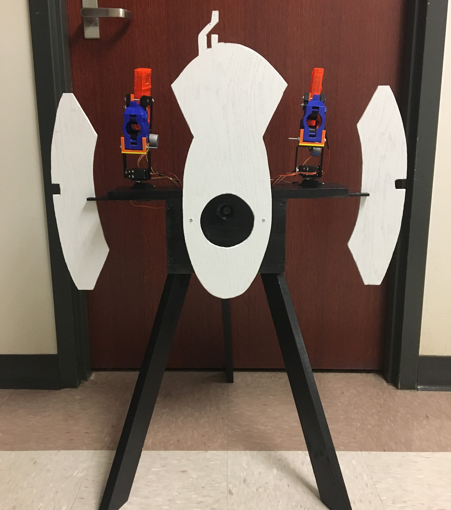

# PortalTurret
For my final senior project at UF I wanted to build something that had machine learning, embedded systems, and would be fun to interact with. I teamed up with my classmate Mason Rawson to make an autonomous turret. Specifically, we made one modeled after the turrets in the game Portal.

## Project Website

Please check out the project's website that showcases the functionality:
https://jbocinsky.github.io/AutonomousTurret/

## Teaser

	

